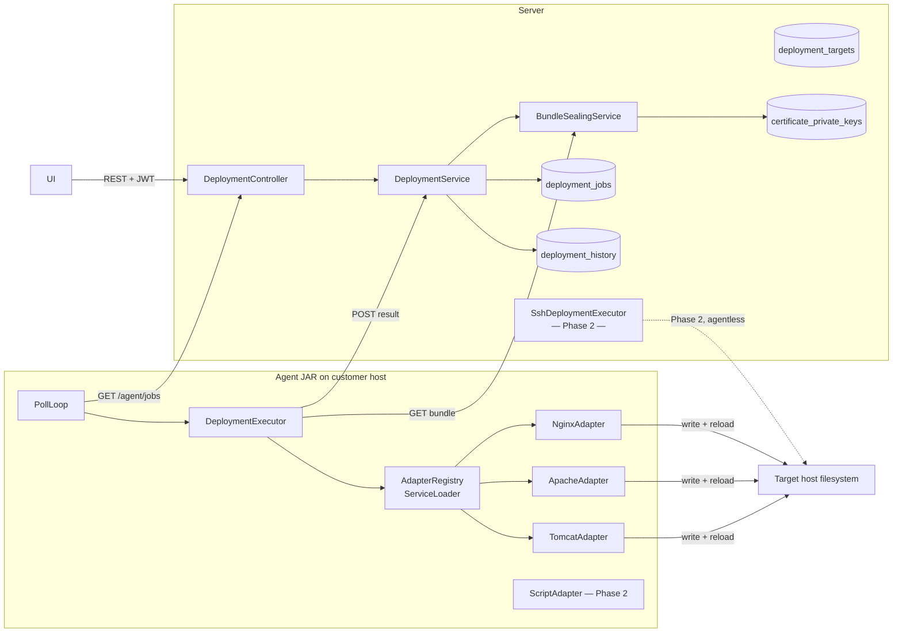
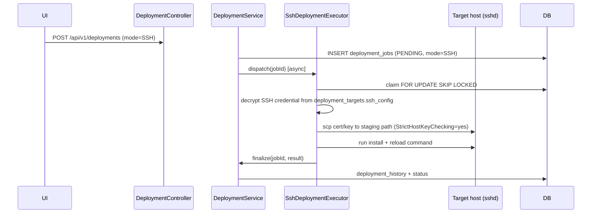

# CertGuard — Certificate Deployment Subsystem Design

> Status: RFC — not yet implemented.
> Anchored against the 2026-04-19 source drop (`certguard-server-source-20260419-0737/`, `certguard-agent-source-20260419-0737/`). Companion to `HLD.md`, `LLD.md`, `GAPS.md`.
>
> **Blocking prerequisites before Phase 1 GA:** P0-1 (Flyway disabled), P0-2 (dev-mode default `true`), R7 (job-claim race) — all tracked in `GAPS.md`.

---

## 1. Overview

This document designs the **certificate deployment subsystem**: the ability for CertGuard to push a renewed or issued certificate and its private key onto a target endpoint and reload the consuming service.

### 1.1 Scope

| In scope (Phase 1) | Deferred |
|---|---|
| Agent-executed deployment | Server-initiated SSH (Phase 2) |
| nginx / Apache / Tomcat adapters | Custom-script adapter (Phase 2) |
| BYO-key upload + encrypted storage | ACME issuer integration (Phase 3) |
| Single-target-per-job | Multi-target deployment plans (Phase 2) |
| Audit trail + UI status polling | Outbound webhooks (Phase 2) |
| Automatic rollback on adapter failure | Manual rollback API (Phase 2) |

### 1.2 Vocabulary

| Term | Meaning |
|---|---|
| **Deployment target** | The "where to install" descriptor: links a `Target` to an agent, install paths, reload command, and method. |
| **Deployment job** | Unit of async work — analogous to `agent_scan_jobs` — claimed by an agent and executed. |
| **Bundle** | The cert + chain + private key + manifest payload sealed for transit. |
| **Adapter** | Strategy that knows _how_ to install on a particular server technology. |
| **Rollback** | Re-deploying the previous certificate from a filesystem backup made before overwrite. |

---

## 2. Architecture

### 2.1 Where deployment fits

Deployment reuses the existing **pull-based job queue** model. `GET /api/v1/agent/jobs` is extended to return a discriminated union so no new poll endpoint is needed:

```json
[
  { "jobType": "SCAN", ... },
  { "jobType": "DEPLOYMENT", "jobId": "uuid", "deploymentTargetId": "uuid",
    "certificateId": "uuid", "method": "NGINX", "bundleUrl": "/api/v1/agent/deployments/{jobId}/bundle",
    "bundleToken": "one-time-opaque-token" }
]
```

Existing agents that do not recognise `DEPLOYMENT` ignore those entries (forward-compatible if `AgentService.pollJobs` gates on `agentVersion`).

### 2.2 Component diagram



### 2.3 Agent-executed deployment sequence

```mermaid
sequenceDiagram
  participant UI
  participant DC as DeploymentController
  participant DS as DeploymentService
  participant BS as BundleSealingService
  participant A as Agent (PollLoop)
  participant DEX as DeploymentExecutor
  participant ADP as Adapter

  UI->>DC: POST /api/v1/deployments
  DC->>DS: validate cert.org_id == orgId, dt.org_id == orgId
  DS->>DB: INSERT deployment_jobs (PENDING)
  DC-->>UI: 202 {jobId, status: PENDING}

  loop every 30s
    A->>DC: GET /api/v1/agent/jobs  (mTLS + HMAC)
    DC->>DS: claim PENDING jobs FOR UPDATE SKIP LOCKED
    DC-->>A: [{jobType:DEPLOYMENT, jobId, bundleUrl, bundleToken}]
  end

  A->>DEX: execute(job)
  DEX->>DC: GET /api/v1/agent/deployments/{jobId}/bundle?token=...
  DC->>BS: seal(cert, chain, key, agentKey)
  BS-->>DC: AES-GCM envelope (token marked used)
  DC-->>DEX: encrypted bundle bytes
  DEX->>DEX: unseal in memory; zero plaintext after dispatch
  DEX->>ADP: install(bundle, spec)
  ADP->>FS: backup current cert/key to <path>.cgbackup-<ts>
  ADP->>FS: atomic write (tmp → rename); chmod 0600 key
  ADP->>FS: run reload command (nginx -t then nginx -s reload)
  ADP-->>DEX: AdapterResult{status, exitCode, durationMs, logTail}
  DEX->>DC: POST /api/v1/agent/deployments/{jobId}/result + HMAC
  DS->>DB: INSERT deployment_history; UPDATE job → COMPLETED|FAILED
  Note over DS: if FAILED and rollbackOnFailure=true → enqueue rollback job
```

### 2.4 Server-initiated SSH sequence (Phase 2)



---

## 3. Data Model

### 3.1 Entity-relationship diagram

```mermaid
erDiagram
  organizations ||--o{ deployment_targets : owns
  organizations ||--o{ deployment_templates : owns
  organizations ||--o{ deployment_jobs : has
  targets ||--o{ deployment_targets : "has install hooks"
  agents ||--o{ deployment_targets : executes
  agents ||--o{ deployment_jobs : claims
  certificates ||--o{ deployment_jobs : deploys
  certificates ||--o| certificate_private_keys : "key for"
  deployment_targets ||--o{ deployment_jobs : queued_for
  deployment_targets ||--o{ deployment_history : audited_in
  deployment_templates ||--o{ deployment_targets : instantiated_as

  deployment_targets {
    UUID id PK
    UUID org_id FK
    UUID target_id FK
    UUID agent_id FK "null if mode=SSH"
    UUID template_id FK "nullable"
    deployment_mode mode "AGENT | SSH"
    deployment_method method "NGINX | APACHE | TOMCAT | CUSTOM_SCRIPT"
    VARCHAR display_name
    VARCHAR cert_install_path
    VARCHAR key_install_path
    VARCHAR chain_install_path "nullable"
    INT file_mode_cert "default 0644"
    INT file_mode_key "default 0600"
    VARCHAR file_owner "user:group, nullable"
    TEXT pre_command "nullable"
    TEXT reload_command
    TEXT post_command "nullable"
    INT timeout_seconds "default 60"
    JSONB ssh_config "AES-GCM ciphertext, nullable"
    BOOL enabled
    UUID last_certificate_id FK "nullable"
    TIMESTAMPTZ last_deployed_at
  }

  deployment_templates {
    UUID id PK
    UUID org_id FK
    VARCHAR name
    deployment_method method
    JSONB defaults
    BOOL system_default
  }

  deployment_jobs {
    UUID id PK
    UUID org_id "denormalized"
    UUID deployment_target_id FK
    UUID certificate_id FK
    UUID agent_id FK "nullable, set at claim"
    deployment_job_status status
    deployment_mode mode
    UUID triggered_by_user_id FK "nullable"
    UUID rollback_of_job_id FK "nullable"
    UUID previous_certificate_id FK "nullable"
    VARCHAR bundle_seal_token_hash "SHA-256, one-time"
    TIMESTAMPTZ bundle_expires_at
    TIMESTAMPTZ claimed_at
    TIMESTAMPTZ started_at
    TIMESTAMPTZ completed_at
    INT attempt_count
    VARCHAR error_code
    TEXT error_msg
  }

  deployment_history {
    UUID id PK
    UUID org_id "denormalized"
    UUID deployment_job_id FK
    UUID deployment_target_id
    UUID certificate_id
    UUID previous_certificate_id "nullable"
    deployment_event event
    JSONB details "redacted logTail, durationMs, exit codes"
    TIMESTAMPTZ occurred_at
  }

  certificate_private_keys {
    UUID id PK
    UUID certificate_id FK UNIQUE
    UUID org_id "denormalized"
    TEXT key_ciphertext "AES-256-GCM, base64"
    VARCHAR key_iv "base64"
    VARCHAR key_source "BYO | ACME"
    TIMESTAMPTZ uploaded_at
    TIMESTAMPTZ expires_at "nullable"
  }
```

### 3.2 Enum types

| Type | Values |
|---|---|
| `deployment_mode` | `AGENT`, `SSH` |
| `deployment_method` | `NGINX`, `APACHE`, `TOMCAT`, `CUSTOM_SCRIPT` |
| `deployment_job_status` | `PENDING`, `CLAIMED`, `IN_PROGRESS`, `COMPLETED`, `FAILED`, `ROLLED_BACK`, `CANCELLED` |
| `deployment_target_status` | `ACTIVE`, `DISABLED` |
| `deployment_event` | `STARTED`, `FILES_WRITTEN`, `RELOAD_OK`, `RELOAD_FAIL`, `ROLLBACK`, `COMPLETED`, `FAILED` |

### 3.3 Flyway migration sketch — V8

> Blocked on GAPS.md P0-1: re-enable `spring.flyway.enabled=true` before adding V8.

```sql
-- V8__deployment_subsystem.sql

CREATE TYPE deployment_mode AS ENUM ('AGENT','SSH');
CREATE TYPE deployment_method AS ENUM ('NGINX','APACHE','TOMCAT','CUSTOM_SCRIPT');
CREATE TYPE deployment_job_status AS ENUM
  ('PENDING','CLAIMED','IN_PROGRESS','COMPLETED','FAILED','ROLLED_BACK','CANCELLED');
CREATE TYPE deployment_target_status AS ENUM ('ACTIVE','DISABLED');
CREATE TYPE deployment_event AS ENUM
  ('STARTED','FILES_WRITTEN','RELOAD_OK','RELOAD_FAIL','ROLLBACK','COMPLETED','FAILED');

CREATE TABLE deployment_templates (
  id                UUID PRIMARY KEY,
  org_id            UUID NOT NULL REFERENCES organizations(id) ON DELETE CASCADE,
  name              VARCHAR(128) NOT NULL,
  method            deployment_method NOT NULL,
  defaults          JSONB NOT NULL DEFAULT '{}',
  system_default    BOOLEAN NOT NULL DEFAULT FALSE,
  created_at        TIMESTAMPTZ NOT NULL DEFAULT now(),
  updated_at        TIMESTAMPTZ NOT NULL DEFAULT now(),
  UNIQUE (org_id, name)
);
CREATE INDEX idx_deployment_templates_org ON deployment_templates(org_id);

CREATE TABLE deployment_targets (
  id                  UUID PRIMARY KEY,
  org_id              UUID NOT NULL REFERENCES organizations(id) ON DELETE CASCADE,
  target_id           UUID NOT NULL REFERENCES targets(id) ON DELETE CASCADE,
  agent_id            UUID REFERENCES agents(id) ON DELETE SET NULL,
  location_id         UUID REFERENCES locations(id) ON DELETE SET NULL,
  mode                deployment_mode NOT NULL,
  method              deployment_method NOT NULL,
  template_id         UUID REFERENCES deployment_templates(id) ON DELETE SET NULL,
  display_name        VARCHAR(128) NOT NULL,
  cert_install_path   VARCHAR(512) NOT NULL,
  key_install_path    VARCHAR(512) NOT NULL,
  chain_install_path  VARCHAR(512),
  file_mode_cert      INTEGER NOT NULL DEFAULT 420,   -- 0644
  file_mode_key       INTEGER NOT NULL DEFAULT 384,   -- 0600
  file_owner          VARCHAR(128),
  pre_command         TEXT,
  reload_command      TEXT NOT NULL,
  post_command        TEXT,
  timeout_seconds     INTEGER NOT NULL DEFAULT 60,
  ssh_config          JSONB,                          -- AES-GCM ciphertext, Phase 2
  enabled             BOOLEAN NOT NULL DEFAULT TRUE,
  status              deployment_target_status NOT NULL DEFAULT 'ACTIVE',
  last_deployed_at    TIMESTAMPTZ,
  last_certificate_id UUID REFERENCES certificate_records(id) ON DELETE SET NULL,
  created_at          TIMESTAMPTZ NOT NULL DEFAULT now(),
  updated_at          TIMESTAMPTZ NOT NULL DEFAULT now(),
  CONSTRAINT chk_agent_required_for_agent_mode
    CHECK ((mode = 'AGENT' AND agent_id IS NOT NULL) OR mode = 'SSH')
);
CREATE INDEX idx_deployment_targets_org    ON deployment_targets(org_id);
CREATE INDEX idx_deployment_targets_target ON deployment_targets(target_id);
CREATE INDEX idx_deployment_targets_agent  ON deployment_targets(agent_id);

CREATE TABLE deployment_jobs (
  id                      UUID PRIMARY KEY,
  org_id                  UUID NOT NULL,
  deployment_target_id    UUID NOT NULL REFERENCES deployment_targets(id) ON DELETE CASCADE,
  certificate_id          UUID NOT NULL REFERENCES certificate_records(id) ON DELETE RESTRICT,
  agent_id                UUID REFERENCES agents(id) ON DELETE SET NULL,
  status                  deployment_job_status NOT NULL DEFAULT 'PENDING',
  mode                    deployment_mode NOT NULL,
  triggered_by_user_id    UUID REFERENCES users(id) ON DELETE SET NULL,
  rollback_of_job_id      UUID REFERENCES deployment_jobs(id) ON DELETE SET NULL,
  previous_certificate_id UUID REFERENCES certificate_records(id) ON DELETE SET NULL,
  bundle_seal_token_hash  VARCHAR(64),               -- SHA-256 of one-time token
  bundle_expires_at       TIMESTAMPTZ,
  claimed_at              TIMESTAMPTZ,
  started_at              TIMESTAMPTZ,
  completed_at            TIMESTAMPTZ,
  attempt_count           INTEGER NOT NULL DEFAULT 0,
  error_code              VARCHAR(64),
  error_msg               TEXT,
  created_at              TIMESTAMPTZ NOT NULL DEFAULT now(),
  updated_at              TIMESTAMPTZ NOT NULL DEFAULT now()
);
CREATE INDEX idx_deployment_jobs_org    ON deployment_jobs(org_id);
CREATE INDEX idx_deployment_jobs_status ON deployment_jobs(status);
CREATE INDEX idx_deployment_jobs_agent  ON deployment_jobs(agent_id);
-- composite used by FOR UPDATE SKIP LOCKED claim query
CREATE INDEX idx_deployment_jobs_claim
  ON deployment_jobs(agent_id, status, created_at)
  WHERE status = 'PENDING';

CREATE TABLE deployment_history (
  id                      UUID PRIMARY KEY,
  org_id                  UUID NOT NULL,
  deployment_job_id       UUID NOT NULL REFERENCES deployment_jobs(id) ON DELETE CASCADE,
  deployment_target_id    UUID NOT NULL,
  certificate_id          UUID NOT NULL,
  previous_certificate_id UUID,
  event                   deployment_event NOT NULL,
  details                 JSONB NOT NULL DEFAULT '{}',
  occurred_at             TIMESTAMPTZ NOT NULL DEFAULT now()
);
CREATE INDEX idx_deployment_history_job ON deployment_history(deployment_job_id);
CREATE INDEX idx_deployment_history_org ON deployment_history(org_id);
CREATE INDEX idx_deployment_history_dt  ON deployment_history(deployment_target_id);

CREATE TABLE certificate_private_keys (
  id              UUID PRIMARY KEY,
  certificate_id  UUID NOT NULL UNIQUE REFERENCES certificate_records(id) ON DELETE CASCADE,
  org_id          UUID NOT NULL,
  key_ciphertext  TEXT NOT NULL,   -- AES-256-GCM, base64
  key_iv          VARCHAR(32) NOT NULL,
  key_source      VARCHAR(16) NOT NULL DEFAULT 'BYO',  -- BYO | ACME
  uploaded_at     TIMESTAMPTZ NOT NULL DEFAULT now(),
  expires_at      TIMESTAMPTZ
);
CREATE INDEX idx_cert_private_keys_org ON certificate_private_keys(org_id);
```

V9 seeds `system_default=true` rows for `NGINX`, `APACHE`, `TOMCAT` in `deployment_templates`.

---

## 4. REST API

### 4.1 Tenant-scoped user endpoints (JWT)

`orgId` is resolved from `TenantContext` (set by `JwtAuthFilter`) per existing controller convention — not repeated in the path.

#### Deployment Targets

| Method | Path | RBAC | Body | Response |
|---|---|---|---|---|
| `GET` | `/api/v1/deployment-targets` | any | `Pageable` | `Page<DeploymentTargetResponse>` |
| `POST` | `/api/v1/deployment-targets` | ADMIN, ENGINEER | `CreateDeploymentTargetRequest` | 201 `DeploymentTargetResponse` |
| `GET` | `/api/v1/deployment-targets/{id}` | any | — | `DeploymentTargetResponse` |
| `PUT` | `/api/v1/deployment-targets/{id}` | ADMIN, ENGINEER | `UpdateDeploymentTargetRequest` | 200 |
| `DELETE` | `/api/v1/deployment-targets/{id}` | ADMIN | — | 204 |
| `POST` | `/api/v1/deployment-targets/{id}/test` | ADMIN, ENGINEER | — | 202 `{jobId}` (dry-run) |
| `GET` | `/api/v1/deployment-targets/{id}/history` | any | `Pageable` | `Page<DeploymentHistoryResponse>` |

#### Deployment Templates

| Method | Path | RBAC | Body | Response |
|---|---|---|---|---|
| `GET` | `/api/v1/deployment-templates` | any | — | `List<DeploymentTemplateResponse>` |
| `POST` | `/api/v1/deployment-templates` | ADMIN | `CreateDeploymentTemplateRequest` | 201 |

#### Deployment Jobs

| Method | Path | RBAC | Body | Response |
|---|---|---|---|---|
| `POST` | `/api/v1/deployments` | ADMIN, ENGINEER | `CreateDeploymentRequest` | 202 `DeploymentJobResponse` |
| `GET` | `/api/v1/deployments` | any | `Pageable`, filters: `status`, `deploymentTargetId`, `certificateId` | `Page<DeploymentJobResponse>` |
| `GET` | `/api/v1/deployments/{jobId}` | any | — | `DeploymentJobResponse` |
| `POST` | `/api/v1/deployments/{jobId}/cancel` | ADMIN, ENGINEER | — | 200 (only if `PENDING` or `CLAIMED`) |
| `POST` | `/api/v1/deployments/{jobId}/rollback` | ADMIN | — | 202 `{jobId}` (Phase 2) |
| `GET` | `/api/v1/deployments/{jobId}/history` | any | — | `List<DeploymentHistoryResponse>` |

#### Private Key Upload

| Method | Path | RBAC | Body | Response |
|---|---|---|---|---|
| `POST` | `/api/v1/certificates/{certId}/private-key` | ADMIN | `UploadPrivateKeyRequest` | 201 |
| `DELETE` | `/api/v1/certificates/{certId}/private-key` | ADMIN | — | 204 |

Private key material is **never returned** in any GET response.

### 4.2 Agent endpoints (X-Agent-Id + X-Agent-Key + HMAC)

| Method | Path | Notes |
|---|---|---|
| `GET` | `/api/v1/agent/jobs` | **Extended** — returns mixed `SCAN` + `DEPLOYMENT` list |
| `GET` | `/api/v1/agent/deployments/{jobId}/bundle?token=...` | One-time; token invalidated on first download; 404 if expired or already used |
| `POST` | `/api/v1/agent/deployments/{jobId}/started` | Marks `IN_PROGRESS`; HMAC-signed |
| `POST` | `/api/v1/agent/deployments/{jobId}/result` | Marks `COMPLETED`/`FAILED`; HMAC-signed |

HMAC canonical string for deployment result:
```
"deploy:" + jobId + ":" + certificateId + ":" + status + ":" + completedAtMs
```

### 4.3 Key request / response shapes

`CreateDeploymentRequest`:
```json
{
  "certificateId": "uuid",
  "deploymentTargetId": "uuid",
  "scheduledAt": "2026-05-03T08:00:00Z",
  "rollbackOnFailure": true
}
```

`DeploymentJobResponse`:
```json
{
  "id": "uuid",
  "status": "PENDING|CLAIMED|IN_PROGRESS|COMPLETED|FAILED|ROLLED_BACK|CANCELLED",
  "mode": "AGENT|SSH",
  "deploymentTargetId": "uuid",
  "certificateId": "uuid",
  "previousCertificateId": "uuid|null",
  "triggeredByUserId": "uuid|null",
  "claimedAt": "iso|null",
  "startedAt": "iso|null",
  "completedAt": "iso|null",
  "errorCode": "string|null",
  "errorMessage": "string|null",
  "attemptCount": 1
}
```

`DeploymentResultRequest` (agent → server):
```json
{
  "status": "COMPLETED|FAILED",
  "completedAtMs": 1700000000000,
  "errorCode": "RELOAD_TIMEOUT|PERMISSION_DENIED|PRECHECK_FAILED|...",
  "errorMessage": "...",
  "events": [
    {"event": "FILES_WRITTEN", "occurredAtMs": 1700000000100, "details": {"bytes": 4096}},
    {"event": "RELOAD_OK",     "occurredAtMs": 1700000000900, "details": {"durationMs": 800, "exitCode": 0}}
  ],
  "logTail": "... last 16KB, PEM-redacted ...",
  "hmac": "base64"
}
```

All error responses use RFC 9457 `ProblemDetail` — consistent with `LLD.md §6`.

---

## 5. Agent-Side Design

### 5.1 Constraints (from `CLAUDE.md`)

The agent must remain **plain Java 17** — no Spring, no Lombok, no DI framework. BouncyCastle, Apache HttpClient 5, Jackson, and Logback are already on the classpath; no new heavy dependencies.

### 5.2 PollLoop extension

`PollLoop.tick()` currently dispatches to `SslScanner`. Change:

```java
for (Job job : jobs) {
    switch (job.jobType()) {
        case SCAN       -> scanner.scan(job);
        case DEPLOYMENT -> deploymentExecutor.execute(job);
    }
}
```

`DeploymentExecutor.execute()` runs on a separate bounded thread pool so a slow deployment cannot block scan dispatch.

### 5.3 Bundle download and unsealing

```
GET /api/v1/agent/deployments/{jobId}/bundle?token=<one-time>
  → encrypted envelope (AES-256-GCM)

Key derivation (server + agent agree):
  dataKey = HKDF(agentKey, salt=jobId, info="cg-deploy-bundle-v1", len=32)
```

Steps in `DeploymentExecutor`:
1. Download bytes over the existing `SecureHttpClient` (TLS 1.3, server-cert pinned).
2. `AES/GCM/NoPadding` decrypt using derived data key.
3. Parse JSON `{certPem, chainPem, keyPem, manifest}` into `DeploymentBundle`.
4. Zero the plaintext byte array after handing `DeploymentBundle` to the adapter.
5. On any exception: mark job `FAILED`, POST result, zero buffers in `finally`.

### 5.4 AdapterRegistry and ServiceLoader

```java
public interface DeploymentAdapter {
    String method();   // "NGINX" | "APACHE" | "TOMCAT" | "CUSTOM_SCRIPT"
    AdapterResult install(DeploymentBundle bundle, DeploymentTargetSpec spec, AdapterContext ctx);
}

public final class AdapterRegistry {
    private final Map<String, DeploymentAdapter> byMethod;
    public AdapterRegistry() {
        var map = new HashMap<String, DeploymentAdapter>();
        ServiceLoader.load(DeploymentAdapter.class)
                     .forEach(a -> map.put(a.method(), a));
        this.byMethod = Map.copyOf(map);
    }
    public DeploymentAdapter forMethod(String m) { ... }
}
```

Customers extend the agent by dropping a JAR into the `lib/extensions/` directory (added to the classpath in `certguard-agent.service`) and providing `META-INF/services/com.certguard.agent.deploy.DeploymentAdapter`.

### 5.5 Built-in adapter behaviour

Every adapter follows the same seven-step sequence:

1. **Pre-check** — verify target paths exist and are writable; emit `PRECHECK_FAILED` and abort if not.
2. **Backup** — copy current cert/key to `<path>.cgbackup-<epoch>` before any overwrite.
3. **Atomic write** — write to `<path>.tmp`, call `fsync`, then `Files.move(ATOMIC_MOVE)`.
4. **Permissions** — `chmod 0600` on key file (before move); `chown` if `file_owner` set.
5. **Config test** — `nginx -t` / `apachectl configtest` / `keytool -list`. Fail-fast before touching the running process.
6. **Reload** — run `reload_command` via `ProcessBuilder` (not `bash -c`) with a hard timeout.
7. **Result** — return `AdapterResult{status, exitCode, durationMs, logTail (last 16 KB)}`.

If step 6 fails and `rollbackOnFailure=true`: restore files from step-2 backup and re-run the reload command. Report `ROLLBACK` event, then `FAILED`.

#### Adapter specifics

| Adapter | Config test | Reload command (allowlisted) |
|---|---|---|
| `NginxAdapter` | `nginx -t` | `nginx -s reload`, `systemctl reload nginx`, `service nginx reload` |
| `ApacheAdapter` | `apachectl configtest` | `apachectl graceful`, `systemctl reload httpd`, `service apache2 graceful` |
| `TomcatAdapter` | `keytool -list -keystore <path>` (after `.p12` build) | `systemctl restart tomcat`, `service tomcat restart` |
| `ScriptAdapter` (Phase 2) | — | path-only, no shell, fixed argv (see §6.2) |

`TomcatAdapter` uses BouncyCastle to build a `.p12` from the PEM inputs before writing, since Tomcat does not support PEM natively in standard config.

---

## 6. Security

### 6.1 Private key in transit and at rest

| Layer | Control |
|---|---|
| **Transport** | Existing TLS 1.3 channel with server-cert fingerprint pinning (`SecureHttpClient`) |
| **Application envelope** | AES-256-GCM per-job bundle; data key derived via HKDF from the agent key + jobId salt |
| **Bundle token** | One-time token; server stores SHA-256 hash only; expires in 5 minutes |
| **At rest (server)** | `certificate_private_keys.key_ciphertext` is AES-256-GCM ciphertext; DEK loaded from env var / KMS, never from DB |
| **In memory (agent)** | `byte[]` only (never `String`); zeroed in `finally` after use |
| **Logging** | Logback `PatternConverter` redacts any PEM private-key block in both server and agent logs; unit-tested |

### 6.2 Custom-script constraints (Phase 2)

- Server stores **a path to an existing script on the host** — it does not ship script content from the cloud.
- Path validated by server: absolute, no `..`, no shell metacharacters (`[;&|$` `` ` ``]`).
- Agent invokes via `ProcessBuilder` with a fixed argv: `[scriptPath, certPath, keyPath, chainPath, prevCertPath]`. No `bash -c`.
- stdout/stderr capped at 16 KB; PEM blocks and `Authorization:` headers stripped before logging or transmission.
- Hard timeout from `timeout_seconds` (default 60, max 600). `Process.destroyForcibly()` on timeout.
- Agent runs under its own unprivileged systemd user; customers grant `NOPASSWD sudoers` for specific reload commands only.

### 6.3 SSH credential protection (Phase 2)

- Key-based auth only (no passwords).
- SSH private key stored AES-GCM-encrypted in `deployment_targets.ssh_config` JSONB; decrypted only inside `SshDeploymentExecutor` at runtime.
- `StrictHostKeyChecking=yes`; known-hosts entry stored alongside the SSH config.
- Per-org concurrency cap (default 5 concurrent SSH deployments) to prevent runaway.

### 6.4 Audit trail

- Every `deployment_jobs` state transition writes a row to `deployment_history` (append-only).
- `triggered_by_user_id` captured from `TenantContext.userId` at job creation.
- `GET /api/v1/audit/deployments?from=&to=` provides SOC2-ready audit export per org.
- Recommend a Postgres trigger that `RAISE EXCEPTION` on `UPDATE`/`DELETE` of `deployment_history`.

### 6.5 Pre-existing gaps that gate this feature

These items from `GAPS.md` / `BACKEND_REVIEW.md` must be resolved before Phase 1 GA:

| Gap | Risk to deployment | Fix |
|---|---|---|
| **P0-1** Flyway disabled | V8 migration never runs | Re-enable `spring.flyway.enabled=true` |
| **P0-2** dev-mode defaults to `true` | Anonymous actor can enqueue deployments | Default to `false` |
| **R1** mTLS is symbolic | Leaked agent key exposes private key bundles | Enforce real mTLS, or rotate agent key per bundle download |
| **R7** job-claim race | Two agents double-deploy same job | `SELECT … FOR UPDATE SKIP LOCKED` on `deployment_jobs` claim (same fix as scan jobs) |
| **R8** JWT no revocation | Demoted user retains deployment RBAC until token expiry | Re-check `org_member_role` at `POST /api/v1/deployments` time; don't trust JWT claim alone |

---

## 7. New Component Map

### 7.1 Server additions (`com.certguard.*`)

| Class | Package | Responsibility |
|---|---|---|
| `DeploymentController` | `controller` | REST surface for targets, templates, jobs, private-key upload |
| `DeploymentService` | `service` | Business logic: validate, enqueue, claim, finalize, rollback |
| `BundleSealingService` | `security` | AES-GCM envelope construction; HKDF key derivation; one-time token issuance |
| `SshDeploymentExecutor` | `service` | Phase 2 — `@Async` SSH deployment for agentless targets |
| `EncryptedJsonbConverter` | `security` | `AttributeConverter<String,String>` for AES-GCM at-rest columns |
| `DeploymentTarget` | `model` | JPA entity |
| `DeploymentTemplate` | `model` | JPA entity |
| `DeploymentJob` | `model` | JPA entity |
| `DeploymentHistory` | `model` | JPA entity (append-only) |
| `CertificatePrivateKey` | `model` | JPA entity |
| `DeploymentTargetRepository` | `repository` | `JpaRepository` |
| `DeploymentJobRepository` | `repository` | `JpaRepository`; custom `@Query` with `FOR UPDATE SKIP LOCKED` |
| `DeploymentHistoryRepository` | `repository` | `JpaRepository` |
| `CertificatePrivateKeyRepository` | `repository` | `JpaRepository` |

### 7.2 Agent additions (`com.certguard.agent.*`)

| Class | Package | Responsibility |
|---|---|---|
| `DeploymentExecutor` | `deploy` | Orchestrates bundle download, adapter dispatch, result reporting |
| `DeploymentAdapter` | `deploy` | Interface: `method()`, `install(bundle, spec, ctx)` |
| `AdapterRegistry` | `deploy` | `ServiceLoader`-based adapter lookup |
| `NginxAdapter` | `deploy.adapter` | nginx install strategy |
| `ApacheAdapter` | `deploy.adapter` | Apache httpd install strategy |
| `TomcatAdapter` | `deploy.adapter` | Tomcat install strategy (PEM → P12 via BouncyCastle) |
| `ScriptAdapter` | `deploy.adapter` | Phase 2 — custom script path execution |
| `DeploymentBundle` | `deploy.model` | Transient holder for cert + key + manifest; fields are `byte[]`, zeroed after use |
| `AdapterResult` | `deploy.model` | Result: status, exitCode, durationMs, logTail |
| `DeploymentTargetSpec` | `deploy.model` | Deserialized deployment target config from job payload |

---

## 8. Open Questions

| # | Question | Recommendation |
|---|---|---|
| OQ-1 | ACME-issued vs BYO-only key custody? | Phase 1 BYO only; Phase 3 ACME integration |
| OQ-2 | Tomcat cert format: agent-side vs server-side P12 conversion? | Agent-side (BouncyCastle already present; smaller blast radius) |
| OQ-3 | Reload failure auto-rollback vs manual? | Auto when `rollbackOnFailure=true` (default); manual API in Phase 2 |
| OQ-4 | Multi-target per deployment call? | Phase 2; Phase 1 is single target per POST |
| OQ-5 | Post-reload TLS verification (re-handshake against 127.0.0.1)? | Phase 2 adapter enhancement |
| OQ-6 | `/api/v1/...` vs `/api/v1/organizations/{orgId}/...` URL convention? | Resolve before implementation; don't fork the API |
| OQ-7 | Cron-based automatic deployment on cert renewal? | Phase 3 `DeploymentPolicy` table |
| OQ-8 | RabbitMQ activation for deployment webhooks? | Phase 2; strongest argument for activating it |

---

## 9. Risk Register

| ID | Risk | Severity | Mitigation |
|---|---|---|---|
| ND-1 | Private key exfiltration via transit or logs | Critical | AES-GCM envelope + log redaction + one-time token |
| ND-2 | Custom-script RCE on customer host | Critical | Path-only, no `bash -c`, fixed argv, reload allowlist |
| ND-3 | Reload failure leaves cluster broken | High | `nginx -t` / `configtest` pre-check; auto-rollback from `.cgbackup-*` |
| ND-4 | Bundle endpoint replay | High | One-time token; SHA-256 hash stored; 5-min TTL |
| ND-5 | Deployment storm (many simultaneous targets) | Medium | Per-org concurrency cap; per-agent claim cap |
| ND-6 | Adapter timeout hangs poll loop | Medium | Adapter runs on bounded executor; main poll loop unaffected |
| ND-7 | Permission drift post-install | Medium | Adapter records actual mode/owner in `deployment_history.details`; alert on mismatch |
| ND-8 | Server-initiated SSH bypasses customer firewall | High | Phase 2 only; require `org.ssh-deploy-enabled=true` + per-target IP allowlist |

---

## 10. Phasing

### Phase 1 — MVP (estimated 4–6 weeks)

- [ ] Resolve blocking prerequisites: P0-1, P0-2, R7 (see §6.5).
- [ ] V8 + V9 Flyway migrations.
- [ ] `certificate_private_keys` table + BYO-key upload endpoint + `EncryptedJsonbConverter`.
- [ ] `DeploymentController`, `DeploymentService`, `BundleSealingService`.
- [ ] `DeploymentJobRepository` with `FOR UPDATE SKIP LOCKED` claim.
- [ ] `GET /api/v1/agent/jobs` extension (discriminated union).
- [ ] Agent: `DeploymentExecutor`, `AdapterRegistry`, `NginxAdapter`, `ApacheAdapter`, `TomcatAdapter`.
- [ ] Automatic rollback on adapter failure (filesystem backup + re-reload).
- [ ] Audit trail (`deployment_history`).
- [ ] Log redaction `PatternConverter` (server + agent).
- [ ] UI: deployment targets CRUD, trigger deployment, status polling.

### Phase 2 — Hardening + agentless (estimated 6–8 weeks)

- [ ] `ScriptAdapter` (CUSTOM_SCRIPT) with §6.2 constraints.
- [ ] `SshDeploymentExecutor` (server-initiated, key-only, StrictHostKeyChecking).
- [ ] Outbound webhooks (`deployment.completed`, `deployment.failed`) — activates RabbitMQ.
- [ ] Multi-target deployment plans.
- [ ] Post-reload TLS re-handshake verification.
- [ ] Manual rollback API (`POST /deployments/{jobId}/rollback`).
- [ ] KMS integration for SSH credential and key DEK.

### Phase 3 — Scale + ACME (future)

- [ ] ACME issuer integration (issue → store → deploy loop; closes OQ-1).
- [ ] Cron-based `DeploymentPolicy` (auto-deploy on renewal).
- [ ] Cross-region SSH relays for agentless behind customer firewalls.
- [ ] Per-org tier concurrency / rate limits.
