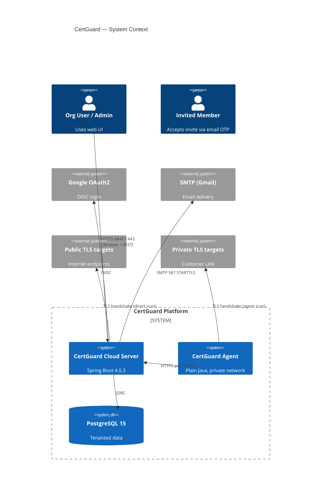
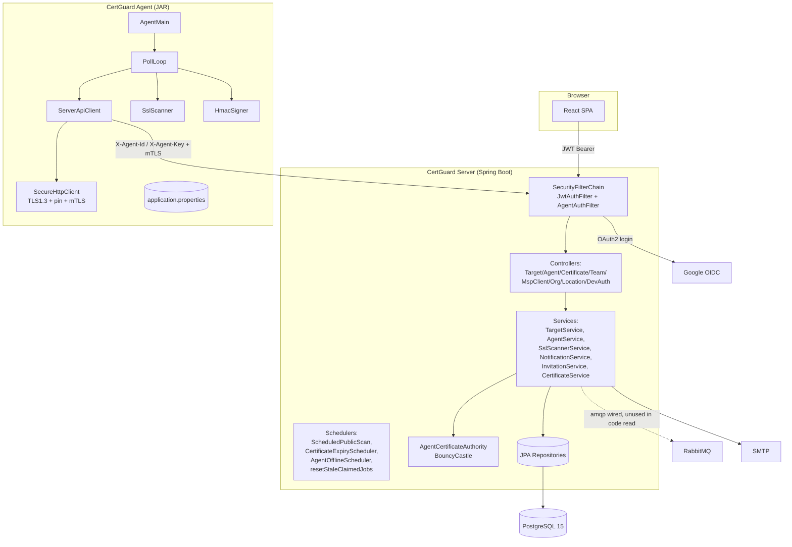
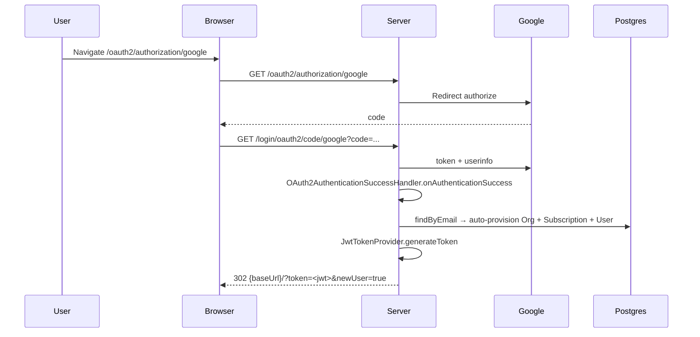
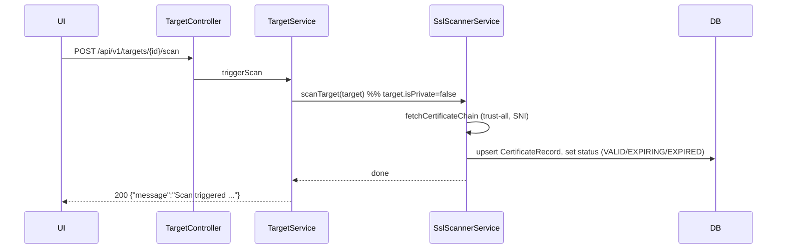
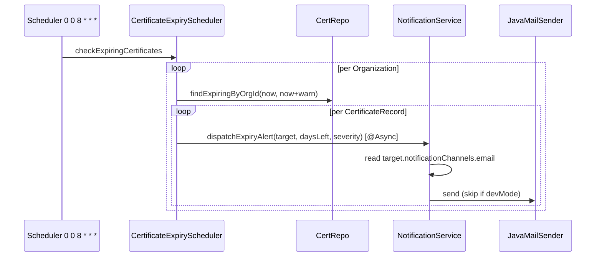
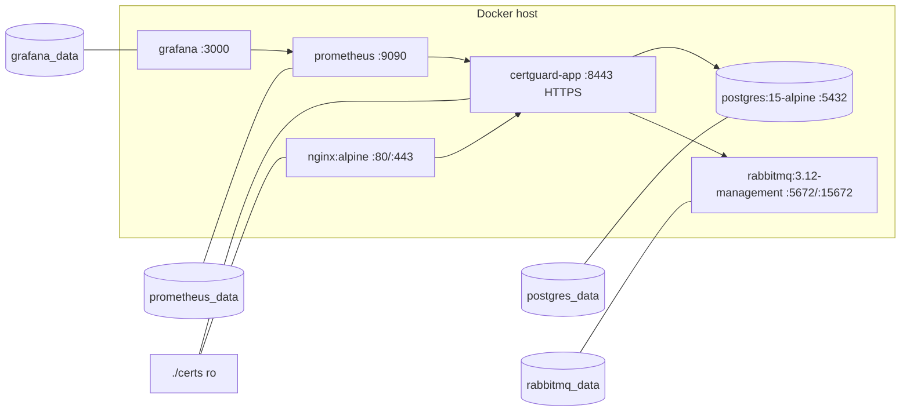

# CertGuard — High-Level Design

## 1. System Context



## 2. Component Diagram



References: `SecurityConfig.java:46-86`, `CertGuardApplication.java:8-11`, `docker-compose.yml:1-173`, `pom.xml:86-88` (amqp dependency present).

## 3. Sequence Diagrams

### 3.1 Google OAuth Login



Anchors: `OAuth2AuthenticationSuccessHandler.java:45-138`, `JwtTokenProvider.java:29-38`.

### 3.2 Add Target

```mermaid
sequenceDiagram
  participant UI
  participant TC as TargetController
  participant TS as TargetService
  participant AR as AgentRepository
  participant DB as Postgres
  UI->>TC: POST /api/v1/targets (Bearer JWT)
  TC->>TS: createTarget(orgId, req)
  TS->>DB: enforceTargetQuota (subscription.max_certificate_quota)
  TS->>DB: existsByOrgHostPort (dedupe)
  alt isPrivate && agentId set
    TS->>AR: findByIdAndOrg; check currentTargetCount < maxTargets
    TS->>TS: validateHostInAgentCidrs
  end
  TS->>DB: save Target, inc agent.current_target_count
  TS-->>UI: 201 TargetResponse
```

Anchors: `TargetController.java:35-39`, `TargetService.java:47-106`.

### 3.3 Direct Scan (public target)



Anchors: `TargetService.java:149-168`, `SslScannerService.java:69-104`.

### 3.4 Agent-based Scan (private target)

```mermaid
sequenceDiagram
  participant UI
  participant TS as TargetService
  participant AS as AgentService
  participant DB
  participant A as Agent
  UI->>TS: POST /targets/{id}/scan (private)
  TS->>AS: queueScanJob(target)
  AS->>DB: insert agent_scan_jobs (PENDING) if none already PENDING/CLAIMED
  loop every pollIntervalSeconds
    A->>+Server: POST /api/v1/agent/heartbeat
    A->>Server: GET /api/v1/agent/jobs
    Server->>DB: findPendingJobsForAgent → mark CLAIMED
    Server-->>A: [{jobId, targetId, host, port, lastKnownSerialHash}]
    A->>A: SslScanner.scan (+ HmacSigner.sign)
    A->>Server: POST /api/v1/agent/results (X-Agent-Id/Key + hmacSignature)
    Server->>Server: AgentHmacService.verify
    Server->>DB: upsert CertificateRecord (FULL) or update (DELTA); job COMPLETED
  end
```

Anchors: `TargetService.java:150-167`, `AgentService.java:136-237`, `PollLoop.java:46-124`, `ServerApiClient.java:74-173`, `AgentHmacService.java:19-38`, `HmacSigner.java:20-30`.

Stale-job recovery: `AgentService.resetStaleClaimedJobs` resets `CLAIMED` > 10 min back to `PENDING` every 5 minutes — `AgentService.java:300-313`.

### 3.5 Notification Dispatch



Anchors: `CertificateExpiryScheduler.java:46-93`, `NotificationService.java:47-101`, `application.yml:76-79`.

Agent-offline alerts follow the same shape via `AgentOfflineScheduler.java:53-123`.

## 4. Data Model Overview

Entities (all extend `BaseEntity` with UUID PK + `created_at`/`updated_at`, `BaseEntity.java:12-25`):

- `Organization` (org hierarchy via `parentOrg`, `orgType` SINGLE|MSP) — `Organization.java`
- `User` (unique `email`, optional `google_sub`, legacy `role` enum) — `User.java`
- `OrgMember` (user ↔ org N:M with `OrgMemberRole` ADMIN|ENGINEER|VIEWER) — `V5__…sql:53-70`
- `Invitation` (token_hash, email OTP flow) — `Invitation.java`
- `Subscription` (1:1 org, `max_certificate_quota`) — `V4__…sql`
- `Location` (org-scoped, cloud/on-prem tagging) — `V5__…sql:27-44`
- `Target` (org, optional agent, optional location, `is_private`, JSONB `notification_channels`, JSONB `tags`) — `Target.java`
- `Agent` (org, hashed key, mTLS cert PEM, JSONB `allowed_cidrs`, quota) — `Agent.java`
- `AgentRegistrationToken` (one-time, expiring) — `V3__…sql:32-43`
- `AgentScanJob` (agent ↔ target, status PENDING|CLAIMED|COMPLETED|FAILED) — `AgentScanJob.java`
- `CertificateRecord` (target-scoped, issuer, serial, expiry, status, key info, SANs) — `CertificateRecord.java`

## 5. Deployment Topology



Anchors: `docker-compose.yml` — network `certguard-net` (bridge, line 172), volumes (161-166), all service ports bound to 127.0.0.1 except nginx :80/:443. App port 8443 is HTTPS with PKCS12 keystore at `/opt/certguard/certs/certguard.p12` (`application.yml:120-127`).

## 6. Non-Functional Concerns

### Security
- TLS: server 8443 TLS 1.2/1.3 via PKCS12 (`application.yml:120-127`); agent pins server cert by SHA-256 fingerprint, else trust-all in dev (`SecureHttpClient.java:109-138`).
- AuthN: JWT HS-signed with 64-char secret (`JwtTokenProvider.java`), JWT in `Authorization: Bearer`; agent auth via `X-Agent-Id` + `X-Agent-Key` BCrypt-verified (`AgentAuthFilter.java:57-109`) plus per-result HMAC-SHA256 (`AgentHmacService.java`).
- AuthZ: `@PreAuthorize("hasRole(...)")` on team/MSP/admin endpoints (`TeamController.java:34`, `OrgController.java:50`, `MspClientController.java:27`). All `/api/v1/**` require auth (`SecurityConfig.java:71`).
- Secrets: BCrypt for token & agent-key hashes; invite tokens stored as SHA-256 hash (`Invitation.java:27-29`).
- Agent CA: self-managed root CA (RSA-4096, 10y) generated lazily to `/opt/certguard/certs/agent-ca*.pem`, signing RSA-2048 client certs 365 days (`AgentCertificateAuthority.java:73-151`, `application.yml:134-139`).

### Multi-tenancy
- ThreadLocal `TenantContext.orgId` set from JWT `orgId` claim (`JwtAuthenticationFilter.java:47-48`), used by every service call.
- Denormalized `org_id` on `certificate_records` and `agent_scan_jobs` for read-side filtering.
- MSP hierarchy via `organizations.parent_org_id` + `MspClientController`.

### Scalability
- HikariCP 20 max (`application.yml:15-17`). Direct scans use 20-thread pool. Async via `@EnableAsync` with 4/10/50 pool (`application.yml:68-71`).
- Agent pull-based model — server does not need to reach inside customer networks.
- RabbitMQ infra running but no `@RabbitListener` or `RabbitTemplate` usage found in code read (phase-3 placeholder).

### Observability
- Actuator `health,info,prometheus` exposed (`application.yml:94-98`), Prometheus + Grafana in compose.
- Logging via Logback; Spring Security at DEBUG (noisy for prod).

### Reliability
- Flyway `repair()` on startup and `validateOnMigrate(false)` (`FlywayConfig.java:13-23`) — risk of accepting checksum drift.
- Stale-job reclaim at 5-min cadence (`AgentService.resetStaleClaimedJobs`).
- Agent offline detection at 5-min cadence, threshold 10 min (`AgentOfflineScheduler`).
- Retry logic on direct scan (3 attempts with linear backoff, `SslScannerService.java:71-81`).

## 7. Open Questions / Risks

1. **Agent mTLS not actually enforced on server.** Server issues client certs, but `AgentAuthFilter` only verifies `X-Agent-Id`/`X-Agent-Key` bearer-style; there is no `sslClientAuth` / client-cert check in `SecurityConfig` or Tomcat connector config. Client cert on the agent is loaded as a cert-only entry with `kmf.init(ks, null)` and no private key (`SecureHttpClient.java:92-98`), so the TLS mutual handshake cannot actually succeed with a private key. The mTLS claim is effectively symbolic.
2. **CORS `allowedOriginPatterns=*` with `allowCredentials=true`** (`SecurityConfig.java:90-94`) — permissive for browser JWT flows.
3. **Direct scanner uses trust-all `X509TrustManager`** (`SslScannerService.java:83-88`) — correct for inventory but must not be reused for any authenticated outbound call.
4. **Flyway `repair()` on every boot + `validateOnMigrate(false)`** — silences migration drift; risks prod drift going undetected.
5. **RabbitMQ infra provisioned but unused by code** — operational cost with no functional benefit; decide to adopt for scan-job dispatch or remove.
6. **OTP store is in-memory `ConcurrentHashMap`** (`InvitationService.java:55-57`) — incompatible with multi-instance deployment; noted as "should be Redis".
7. **Dev fallbacks dangerous if leaked to prod**: `APP_DEV_MODE=true` default bypasses OAuth, enables `/api/v1/auth/dev-token` (`DevAuthController.java:48-86`), and short-circuits email sends.
8. **`agent_scan_jobs` claim has no locking** — `findPendingJobsForAgent` + save in `AgentService.pollJobs` (`AgentService.java:136-144`) is subject to double-claim under concurrent agents (only one per org realistically, but worth `SELECT … FOR UPDATE SKIP LOCKED`).
9. **JWT long-lived (24h), no refresh, no revocation list** (`application.yml:66`). Revoking an agent's key works (status check in filter) but revoking a user JWT does not.
10. **No pagination index strategy** documented for `certificate_records` beyond expiry/status/target/org indexes (`V1`).
