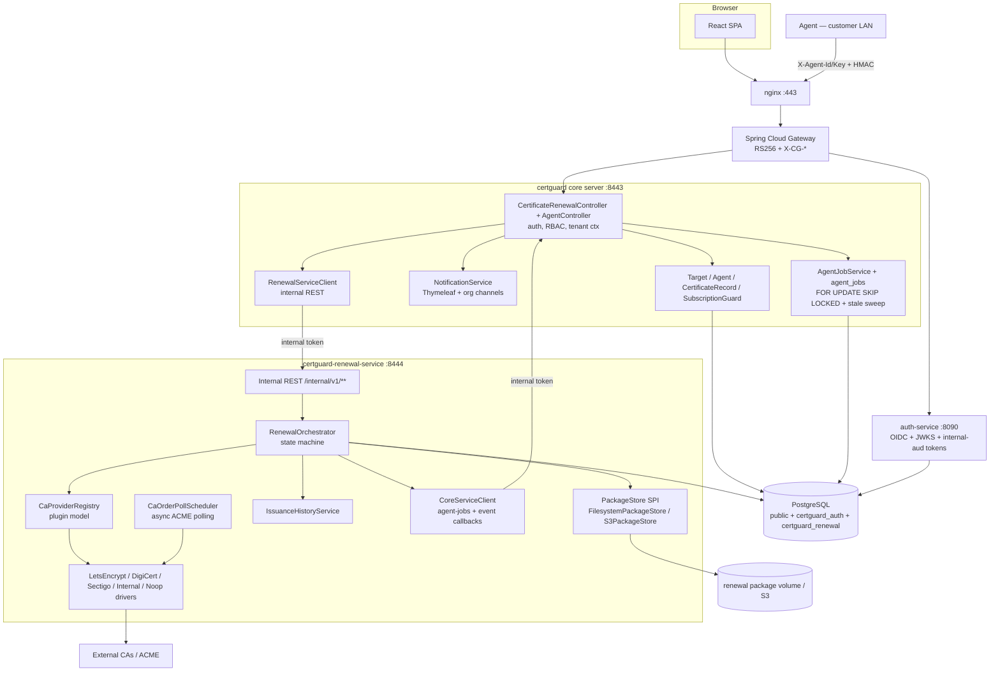

# RFC 0005 — Extracting Certificate Renewal into `certguard-renewal-service`

- **Status:** Proposed (supersedes the "keep in core" recommendation; user confirmed extraction 2026-05-29)
- **Authors:** CertGuard Architect
- **Relates to:** RFC 0004 (renewal feature as-built in core), HLD §1/§2, LLD §2/§3, GAPS R9
- **Motivation (user, verbatim):** "I want to have a clean implementation as it would involve multiple provider integration as we progress. Scalability will be a concern and we also will need to maintain historic data of certs issued."

This RFC extracts RFC 0004's renewal capability out of the core server into a dedicated Spring Boot microservice, `certguard-renewal-service`. It solves the FK-coupling problem with **soft UUID references + a separate schema**, keeps `agent_jobs` core-owned (driven via an internal API), keeps the agent talking to core only (Option A), and makes the multi-CA-provider SPI and certificate-issuance history first-class concerns of the new service.

---

## 0. Grounding corrections

- **There is no RabbitMQ in the live system.** `server/docker-compose.yml` has no rabbitmq container and `server/pom.xml` has no `spring-boot-starter-amqp`. `GAPS.md` R9 references these as present — that entry is stale and corrected in §10.
- **Live topology is nginx → Spring Cloud Gateway → {auth-service, core}** with the `X-CG-*` header-trust contract. The renewal service slots **behind** core on the internal Docker network and is never exposed via nginx/gateway.
- The agent pins one URL at bundle install and authenticates with `X-Agent-Id`/`X-Agent-Key` + HMAC, verified by `AgentAuthFilter` in core. This is preserved unchanged (Option A).

---

## 1. Service boundary

`certguard-renewal-service` owns the **renewal lifecycle, CA provider integrations, package storage/serving, and issuance history**. The core server keeps the **user-facing and agent-facing edges, the agent-job durable queue, notification dispatch, and all multi-tenant/auth context**, delegating to the renewal service over an internal API.

| Concern | Owner | Notes |
|---|---|---|
| User REST API `POST/GET /api/v1/certificates/{certId}/renewals`, `GET /api/v1/renewals/{id}`, `POST .../cancel`, `GET .../package` | **Core (edge) → proxies to renewal service** | Paths unchanged; gateway/auth/tenant context stays in core. UI sees no change. |
| Renewal state machine (`REQUESTED → … → DELIVERED/FAILED/CANCELLED`) | **Renewal service** | `RenewalStatus` enum and orchestration move out. |
| `certificate_renewal_requests` table | **Renewal service** (schema `certguard_renewal`) | Soft UUID refs; no cross-schema FK. |
| `certificate_packages` table + filesystem/object store | **Renewal service** | Writes + serves bytes; core proxies the stream (§5). |
| `ca_orders` table (new) + CA order polling | **Renewal service** | First-class CA order tracking for async providers (ACME). |
| `cert_issuance_history` table (new) | **Renewal service** | Authoritative issuance ledger (user requirement). |
| `ca_provider_credentials` table (new) | **Renewal service** | Per-org CA credentials, encrypted at rest (§8). |
| Multi-CA `CaProvider` SPI + all concrete drivers (LetsEncrypt/DigiCert/Sectigo/Internal) | **Renewal service** | The whole point of the split. |
| `agent_jobs` table + claim (`FOR UPDATE SKIP LOCKED`) + stale-claim sweep | **Core** | Claimed inside the `AgentAuthFilter`-gated agent request; FKs `agents`/`targets`. Renewal service drives it via internal API (§3B). |
| Agent endpoints `GET /api/v1/agent/delivery-jobs`, `POST .../csr`, `GET .../package`, `POST .../report` | **Core** | Agent auth + HMAC stay in one place (`AgentController.java`). |
| Expiry-email deep-link/agent-gating + renewal emails (`renewal-ready/installed/failed`) | **Core `NotificationService`** | Thymeleaf templates + org notification channels; triggered by renewal→core callback (§3D). |
| `SubscriptionGuard`, `TenantContext`, RBAC `@PreAuthorize` | **Core** | Authorization decisions stay at the edge. |
| Core domain (`Target`, `Agent`, `CertificateRecord`, `Organization`) | **Core** | Renewal service never writes these; reads CN/SANs via internal API. |

**Design rule:** exactly one service owns each piece of state. The renewal state machine and the agent-job queue are deliberately split across the boundary, connected only by internal API calls — never by a shared transaction.

---

## 2. Renewal-service data model

Separate PostgreSQL schema **`certguard_renewal`** on the **same Postgres instance**. Tables use **soft UUID references with NO FK constraints** to core tables; existence is validated via the internal core API at request time, and orphan cleanup is handled by a reconciliation sweep (§7.4). Intra-schema FKs within `certguard_renewal` are used normally.

```sql
-- Flyway V1__renewal_baseline.sql (certguard-renewal-service, schema certguard_renewal)

CREATE TYPE renewal_status AS ENUM (
    'REQUESTED','CSR_PENDING','CSR_RECEIVED','CA_PENDING','CA_ISSUED',
    'STORED','DELIVERY_QUEUED','DELIVERED','FAILED','CANCELLED');
CREATE TYPE ca_provider_type AS ENUM ('NONE','LETS_ENCRYPT','DIGICERT','SECTIGO','INTERNAL');
CREATE TYPE ca_order_status  AS ENUM ('CREATED','PENDING','VALIDATING','ISSUED','FAILED','REVOKED');

CREATE TABLE certificate_renewal_requests (
    id                   UUID PRIMARY KEY DEFAULT gen_random_uuid(),
    org_id               UUID NOT NULL,              -- soft ref → core organizations.id
    certificate_id       UUID NOT NULL,              -- soft ref → core certificate_records.id
    target_id            UUID NOT NULL,              -- soft ref → core targets.id
    agent_id             UUID,                       -- soft ref → core agents.id
    -- snapshot of core data at request time (preserves history, avoids hot-path re-fetch):
    common_name          VARCHAR(255),
    sans                 JSONB NOT NULL DEFAULT '[]',
    status               renewal_status   NOT NULL DEFAULT 'REQUESTED',
    ca_provider          ca_provider_type NOT NULL DEFAULT 'NONE',
    ca_external_ref      VARCHAR(256),
    csr_pem              TEXT,
    requested_by         UUID NOT NULL,              -- soft ref → core users.id (X-CG-User-Id)
    target_install_path  VARCHAR(1024),
    package_id           UUID,                       -- set once stored; intra-schema FK added below
    core_csr_job_id      UUID,                       -- soft ref → core agent_jobs.id
    core_delivery_job_id UUID,                       -- soft ref → core agent_jobs.id
    failure_reason       TEXT,
    created_at           TIMESTAMPTZ NOT NULL DEFAULT now(),
    updated_at           TIMESTAMPTZ NOT NULL DEFAULT now()
);

CREATE TABLE certificate_packages (
    id                  UUID PRIMARY KEY DEFAULT gen_random_uuid(),
    org_id              UUID NOT NULL,
    renewal_id          UUID NOT NULL REFERENCES certificate_renewal_requests(id) ON DELETE CASCADE,
    storage_path        VARCHAR(1024) NOT NULL,
    file_name           VARCHAR(256)  NOT NULL,
    content_type        VARCHAR(128)  NOT NULL DEFAULT 'application/x-pem-file',
    size_bytes          BIGINT        NOT NULL,
    checksum_sha256     VARCHAR(64)   NOT NULL,
    downloaded_at       TIMESTAMPTZ,
    expires_at          TIMESTAMPTZ,
    created_at          TIMESTAMPTZ NOT NULL DEFAULT now()
);

ALTER TABLE certificate_renewal_requests
    ADD CONSTRAINT fk_renewal_package
    FOREIGN KEY (package_id) REFERENCES certificate_packages(id) ON DELETE SET NULL;

CREATE TABLE ca_orders (
    id             UUID PRIMARY KEY DEFAULT gen_random_uuid(),
    renewal_id     UUID NOT NULL REFERENCES certificate_renewal_requests(id) ON DELETE CASCADE,
    org_id         UUID NOT NULL,
    ca_provider    ca_provider_type NOT NULL,
    external_ref   VARCHAR(256),              -- ACME order URL / vendor order id
    status         ca_order_status  NOT NULL DEFAULT 'CREATED',
    attempt_count  INT NOT NULL DEFAULT 0,
    last_polled_at TIMESTAMPTZ,
    error_detail   TEXT,
    created_at     TIMESTAMPTZ NOT NULL DEFAULT now(),
    updated_at     TIMESTAMPTZ NOT NULL DEFAULT now()
);

-- Authoritative issuance ledger (immutable, append-only). Survives renewal deletion.
CREATE TABLE cert_issuance_history (
    id              UUID PRIMARY KEY DEFAULT gen_random_uuid(),
    org_id          UUID NOT NULL,
    certificate_id  UUID,                     -- soft ref; nullable if cert later deleted in core
    target_id       UUID,
    renewal_id      UUID,                     -- soft ref; NOT a FK (history outlives renewals)
    ca_provider     ca_provider_type NOT NULL,
    common_name     VARCHAR(255),
    sans            JSONB NOT NULL DEFAULT '[]',
    serial_number   VARCHAR(128),
    not_before      TIMESTAMPTZ,
    not_after       TIMESTAMPTZ,
    checksum_sha256 VARCHAR(64),
    outcome         VARCHAR(32) NOT NULL,     -- ISSUED | FAILED
    issued_at       TIMESTAMPTZ NOT NULL DEFAULT now()
);

-- CA credentials per provider per org (secrets AES-256-GCM encrypted — §8).
CREATE TABLE ca_provider_credentials (
    id                UUID PRIMARY KEY DEFAULT gen_random_uuid(),
    org_id            UUID,                   -- NULL = platform default credential
    ca_provider       ca_provider_type NOT NULL,
    display_name      VARCHAR(128) NOT NULL,
    enabled           BOOLEAN NOT NULL DEFAULT true,
    config_json       JSONB NOT NULL DEFAULT '{}',  -- non-secret config (acct URL, validity days)
    secret_ciphertext BYTEA,                        -- AES-256-GCM encrypted secret blob
    created_at        TIMESTAMPTZ NOT NULL DEFAULT now(),
    updated_at        TIMESTAMPTZ NOT NULL DEFAULT now(),
    UNIQUE (org_id, ca_provider)
);

CREATE INDEX idx_renewal_org      ON certificate_renewal_requests(org_id);
CREATE INDEX idx_renewal_cert     ON certificate_renewal_requests(certificate_id);
CREATE INDEX idx_renewal_status   ON certificate_renewal_requests(status);
CREATE INDEX idx_pkg_renewal      ON certificate_packages(renewal_id);
CREATE INDEX idx_caorder_status   ON ca_orders(status);
CREATE INDEX idx_issuance_org     ON cert_issuance_history(org_id);
CREATE INDEX idx_issuance_cert    ON cert_issuance_history(certificate_id);
```

**Why soft refs:** Postgres cross-schema FKs re-weld the renewal service's schema lifecycle to core's migration order and prevent `cert_issuance_history` from outliving a deleted `certificate_record`. Soft UUID refs + reconciliation sweep (§7.4) give true schema independence. Intra-schema FKs within `certguard_renewal` are kept normally.

**CN/SANs snapshot** on the renewal row removes the hot-path dependency on core for the CA call and makes history self-contained.

---

## 3. Internal API surface (core ↔ renewal-service)

All internal endpoints are on the **internal Docker network only**, never routed by nginx/gateway. Auth: service-to-service bearer token — RS256 JWT with `aud=certguard-internal`, validated against auth-service JWKS. Network isolation (both services internal-bound) is the additional layer. Shared HS256 secrets are explicitly rejected.

### 3A. Renewal service exposes (consumed by core edge controllers)

| Method | Path (on renewal-service `:8444`) | Caller | Purpose |
|---|---|---|---|
| POST | `/internal/v1/renewals` | core `CertificateRenewalController` | Create renewal. Body: org/cert/target/agent UUIDs + CN + SANs + requestedBy + caProvider + installPath (core has already authorized + validated agent-managed). Returns `RenewalResponse{status=CSR_PENDING}`. |
| GET | `/internal/v1/renewals/{renewalId}?orgId=` | core `getRenewal` | Single renewal (org-scoped). |
| GET | `/internal/v1/certificates/{certId}/renewals?orgId=` | core `listRenewals` | Renewals for a cert. |
| POST | `/internal/v1/renewals/{renewalId}/cancel?orgId=` | core `cancelRenewal` | Cancel. |
| GET | `/internal/v1/renewals/{renewalId}/package?orgId=` | core (user download + agent download proxy) | Streams PEM bytes + `X-Checksum-SHA256`. Core proxies; renewal service owns the file (§5). |
| POST | `/internal/v1/csr` | core `AgentController.submitCsr` | Agent-submitted CSR relayed by core. Body: `{coreCsrJobId, csrPem, agentId}`. Triggers CA call. |
| POST | `/internal/v1/renewals/{renewalId}/delivery-result` | core `AgentController.reportJob` | Agent's SUCCESS/FAILED install result relayed by core. Flips renewal DELIVERED/FAILED; writes `cert_issuance_history`. |
| GET | `/internal/v1/orgs/{orgId}/renewal-history?from=&to=&page=` | core dashboard | Issuance history (cert_issuance_history rows). |
| GET | `/internal/v1/orgs/{orgId}/renewal-summary` | core dashboard | Counts by status/provider for dashboard tile. |

### 3B. Core exposes (consumed by renewal-service to drive `agent_jobs`)

`agent_jobs` stays in core; the renewal service asks core to enqueue jobs. The agent claims them through existing core agent endpoints.

| Method | Path (on core `:8443/internal`) | Caller | Purpose |
|---|---|---|---|
| POST | `/internal/v1/agent-jobs` | renewal-service | Enqueue `CERT_RENEW_CSR` or `CERT_DELIVERY` job. Body: `{agentId, orgId, targetId, renewalId, jobType, payload, dedupKey}`. Reuses `AgentJobService` dedup logic. Returns `{coreJobId}`. |
| POST | `/internal/v1/agent-jobs/{coreJobId}/cancel` | renewal-service | Cancel an in-flight agent job when a renewal is cancelled. |
| GET | `/internal/v1/agents/{agentId}` | renewal-service (validation/reconciliation) | Confirm agent exists + is active + belongs to org. |
| GET | `/internal/v1/certificates/{certId}?orgId=` | renewal-service (snapshot refresh) | Returns CN + SANs + target/agent ids. |

### 3C. Existence validation (soft-ref integrity)

When core calls `POST /internal/v1/renewals`, it has **already** loaded the `CertificateRecord` and verified `target.getAgent() != null`. That validated data (orgId, certId, targetId, agentId, CN, SANs) is passed in the request body — no round-trip needed on the happy path. The `GET /internal/v1/agents` and `GET /internal/v1/certificates` endpoints exist for the reconciliation sweep (§7.4).

### 3D. Renewal → core callbacks (lifecycle events)

| Method | Path (on core `:8443/internal`) | When | Effect in core |
|---|---|---|---|
| POST | `/internal/v1/renewal-events` | On STORED, DELIVERED, FAILED transitions | `{renewalId, orgId, event, certId, targetId, agentId, packageMeta?, failureDetail?}`. Core: on `STORED` → enqueue `CERT_DELIVERY` agent-job + `dispatchRenewalReady`; on `DELIVERED` → `dispatchRenewalInstalled`; on `FAILED` → `dispatchRenewalFailed`. |

The agent's `POST /report` (SUCCESS/FAILED) is received by core (`AgentController.reportJob`). Core relays the terminal status to the renewal service via `POST /internal/v1/renewals/{id}/delivery-result`. The renewal service flips DELIVERED/FAILED and writes `cert_issuance_history`. Core fires the notification locally so notification dispatch stays single-owner.

---

## 4. Component & sequence diagrams

### 4.1 Component diagram



### 4.2 Sequence — renewal request through CSR, CA, delivery

```
UI → POST /api/v1/certificates/{certId}/renewals
  Core: authorize + load cert + assert agent-managed + SubscriptionGuard
  Core → renewal: POST /internal/v1/renewals {org,cert,target,agent,CN,SANs}
    Renewal: insert renewal REQUESTED
    Renewal → core: POST /internal/v1/agent-jobs {CERT_RENEW_CSR}
    Core: agent_jobs row PENDING (dedup) → {coreCsrJobId}
    Renewal: status CSR_PENDING
  Core → UI: 202 {status: CSR_PENDING}

Agent → Core: GET /api/v1/agent/delivery-jobs  (claims CSR job)
Agent → Agent: CsrGenerator (keypair + CSR, private key stays on host)
Agent → Core: POST /api/v1/agent/jobs/{coreCsrJobId}/csr {csrPem}
  Core → renewal: POST /internal/v1/csr {coreCsrJobId, csrPem, agentId}
  Core: complete CSR agent_job
  Renewal: status CSR_RECEIVED → CA_PENDING (@Async)
  Renewal: CaProviderRegistry.resolve(orgId) → driver
  Driver → CA: requestCertificate(CaRenewalRequest{csrPem})
    [sync] CA returns signed cert + chain
    [async/ACME] ca_orders row created; CaOrderPollScheduler polls until ISSUED
  Renewal: PackageStore.store(cert+chain) → certificate_packages
           write ca_orders(ISSUED) + cert_issuance_history(ISSUED)
           status STORED
  Renewal → core: POST /internal/v1/renewal-events {event:STORED, packageMeta}
  Core: enqueue CERT_DELIVERY agent_job + dispatchRenewalReady email
  Renewal: status DELIVERY_QUEUED

Agent → Core: GET /api/v1/agent/delivery-jobs  (claims delivery job)
Agent → Core: GET /api/v1/agent/jobs/{deliveryJobId}/package
  Core → renewal: GET /internal/v1/renewals/{id}/package  (proxy stream)
  Core → Agent: PEM bytes + X-Checksum-SHA256
Agent → Agent: CertInstaller (atomic write + optional hook)
Agent → Core: POST /api/v1/agent/jobs/{deliveryJobId}/report {SUCCESS}
  Core: complete delivery agent_job
  Core → renewal: POST /internal/v1/renewals/{id}/delivery-result {SUCCESS}
  Renewal: status DELIVERED; cert_issuance_history record updated
  Core: dispatchRenewalInstalled email
```

---

## 5. Certificate package storage

The renewal service owns the package store and serves the bytes. Core proxies the stream to both the agent and the user. Core never touches the renewal filesystem.

- **MVP:** shared volume (`renewal_packages`) at `RENEWAL_STORAGE_PATH`. `PackageStore` interface with `FilesystemPackageStore` implementation.
- **Scale path:** `S3PackageStore` implementation, selected via `app.renewal.storage.backend=S3`. The interface is identical; no orchestrator changes.
- User download (`GET /api/v1/renewals/{id}/package`): core authorizes, streams from `GET /internal/v1/renewals/{id}/package?orgId=`.
- Agent download (`GET /api/v1/agent/jobs/{jobId}/package`): core verifies agent owns the job, proxies from the renewal service, forwards `X-Checksum-SHA256`.

---

## 6. docker-compose changes

```yaml
  # CertGuard Renewal Service
  renewal-service:
    build:
      context: ../certguard-renewal-service
      dockerfile: Dockerfile
    container_name: certguard-renewal-service
    restart: unless-stopped
    depends_on:
      postgres:
        condition: service_healthy
    environment:
      SPRING_DATASOURCE_URL:       jdbc:postgresql://postgres:5432/${POSTGRES_DB}?currentSchema=certguard_renewal
      SPRING_DATASOURCE_USERNAME:  ${RENEWAL_DB_USER:-renewal_user}
      SPRING_DATASOURCE_PASSWORD:  ${RENEWAL_DB_PASSWORD}
      RENEWAL_INTERNAL_AUD:        certguard-internal
      GATEWAY_JWKS_URI:            http://auth-service:8090/api/auth/.well-known/jwks.json
      CORE_INTERNAL_BASE_URL:      https://app:8443
      RENEWAL_STORAGE_PATH:        /opt/certguard/renewals
      RENEWAL_STORAGE_BACKEND:     ${RENEWAL_STORAGE_BACKEND:-FILESYSTEM}
      RENEWAL_CA_PROVIDER_DEFAULT: ${RENEWAL_CA_PROVIDER:-NONE}
      RENEWAL_CREDENTIAL_KEK:      ${RENEWAL_CREDENTIAL_KEK}
      JAVA_OPTS: "-Xms256m -Xmx512m -XX:+UseContainerSupport"
    ports:
      - "127.0.0.1:8444:8444"    # internal only — never proxied by nginx
    volumes:
      - renewal_packages:/opt/certguard/renewals
    healthcheck:
      test: ["CMD-SHELL", "wget -qO- http://localhost:8444/actuator/health | grep -q UP || exit 1"]
      interval: 30s
      timeout: 10s
      retries: 3
      start_period: 60s
    networks:
      - certguard-net
```

Add to top-level `volumes`:
```yaml
  renewal_packages:
```

Core `app` service gains:
```yaml
      RENEWAL_SERVICE_BASE_URL: http://renewal-service:8444
      RENEWAL_INTERNAL_AUD:     certguard-internal
```

The Postgres init scripts (`./postgres/init`) gain a step creating schema `certguard_renewal` and role `renewal_user` with rights only on that schema.

**nginx.conf is unchanged** — no public route to the renewal service.

---

## 7. Maven skeleton — `certguard-renewal-service`

```xml
<project>
  <modelVersion>4.0.0</modelVersion>
  <parent>
    <groupId>org.springframework.boot</groupId>
    <artifactId>spring-boot-starter-parent</artifactId>
    <version>4.0.3</version>
    <relativePath/>
  </parent>
  <groupId>com.certguard</groupId>
  <artifactId>certguard-renewal-service</artifactId>
  <version>1.0.0-SNAPSHOT</version>
  <name>CertGuard Renewal Service</name>
  <properties>
    <java.version>25</java.version>
  </properties>
  <dependencies>
    <dependency><groupId>org.springframework.boot</groupId><artifactId>spring-boot-starter-web</artifactId></dependency>
    <dependency><groupId>org.springframework.boot</groupId><artifactId>spring-boot-starter-data-jpa</artifactId></dependency>
    <dependency><groupId>org.springframework.boot</groupId><artifactId>spring-boot-starter-validation</artifactId></dependency>
    <dependency><groupId>org.springframework.boot</groupId><artifactId>spring-boot-starter-actuator</artifactId></dependency>
    <dependency><groupId>io.micrometer</groupId><artifactId>micrometer-registry-prometheus</artifactId></dependency>
    <!-- Internal-token validation: RS256 resource server against auth-service JWKS -->
    <dependency><groupId>org.springframework.boot</groupId><artifactId>spring-boot-starter-oauth2-resource-server</artifactId></dependency>
    <dependency><groupId>org.postgresql</groupId><artifactId>postgresql</artifactId><scope>runtime</scope></dependency>
    <dependency><groupId>org.flywaydb</groupId><artifactId>flyway-core</artifactId><version>11.3.0</version></dependency>
    <dependency><groupId>org.flywaydb</groupId><artifactId>flyway-database-postgresql</artifactId><version>11.3.0</version></dependency>
    <!-- CSR / PKCS handling + ACME for Let's Encrypt -->
    <dependency><groupId>org.bouncycastle</groupId><artifactId>bcpkix-jdk18on</artifactId><version>1.78.1</version></dependency>
    <dependency><groupId>org.shredzone.acme4j</groupId><artifactId>acme4j-client</artifactId><version>3.4.0</version></dependency>
    <dependency><groupId>org.projectlombok</groupId><artifactId>lombok</artifactId><optional>true</optional></dependency>
    <!-- ShedLock for CA-poll and reconciliation schedulers -->
    <dependency><groupId>net.javacrumbs.shedlock</groupId><artifactId>shedlock-spring</artifactId><version>6.9.2</version></dependency>
    <dependency><groupId>net.javacrumbs.shedlock</groupId><artifactId>shedlock-provider-jdbc-template</artifactId><version>6.9.2</version></dependency>
    <dependency><groupId>org.springframework.boot</groupId><artifactId>spring-boot-starter-test</artifactId><scope>test</scope></dependency>
    <dependency><groupId>org.testcontainers</groupId><artifactId>postgresql</artifactId><version>1.20.4</version><scope>test</scope></dependency>
  </dependencies>
</project>
```

**Deliberately absent:** `spring-boot-starter-amqp` (no broker), `spring-boot-starter-mail`/`thymeleaf` (notifications stay in core), agent-auth machinery.

### 7.1 Package structure

```
com.certguard.renewal
  .web              — internal REST controllers (/internal/v1/**)
  .orchestration    — RenewalOrchestrator (state machine)
  .entity           — CertificateRenewalRequest, CertificatePackage, CaOrder,
                      CertIssuanceHistory, CaProviderCredential
  .repository       — JPA repositories
  .ca               — CaProvider SPI + CaProviderRegistry + drivers
                      (LetsEncryptCaProvider, DigicertCaProvider,
                       SectigoCaProvider, InternalCaProvider, NoopCaProvider)
  .storage          — PackageStore SPI + FilesystemPackageStore + S3PackageStore
  .client           — CoreServiceClient (agent-jobs + event callbacks to core)
  .security         — InternalTokenSecurityConfig (aud=certguard-internal)
  .scheduler        — CaOrderPollScheduler, OrphanReconciliationScheduler
  .config           — AsyncConfig, SchedulerLockConfig, etc.
```

### 7.2 application.yml (renewal service)

```yaml
server:
  port: 8444
  address: 0.0.0.0

spring:
  datasource:
    url: ${SPRING_DATASOURCE_URL}
    username: ${SPRING_DATASOURCE_USERNAME}
    password: ${SPRING_DATASOURCE_PASSWORD}
  jpa:
    hibernate:
      ddl-auto: validate
    properties:
      hibernate.default_schema: certguard_renewal
  flyway:
    schemas: certguard_renewal
    locations: classpath:db/migration
  security:
    oauth2:
      resourceserver:
        jwt:
          jwk-set-uri: ${GATEWAY_JWKS_URI}
          audiences: ${RENEWAL_INTERNAL_AUD:certguard-internal}

app:
  core-base-url: ${CORE_INTERNAL_BASE_URL:http://app:8443}
  renewal:
    storage:
      path: ${RENEWAL_STORAGE_PATH:/opt/certguard/renewals}
      backend: ${RENEWAL_STORAGE_BACKEND:FILESYSTEM}    # FILESYSTEM | S3
    ca:
      provider-default: ${RENEWAL_CA_PROVIDER_DEFAULT:NONE}
      credential-kek: ${RENEWAL_CREDENTIAL_KEK}         # AES-256 key-encryption key (§8)
    poll:
      ca-order-interval-seconds: ${CA_ORDER_POLL_INTERVAL:60}
      reconcile-interval-minutes: ${RECONCILE_INTERVAL_MINUTES:30}
```

### 7.4 Orphan reconciliation scheduler

`OrphanReconciliationScheduler` (every N minutes, `@SchedulerLock`) batches active renewals and calls core `GET /internal/v1/certificates/{certId}?orgId=` and `GET /internal/v1/agents/{agentId}`. Renewals whose cert/agent/target no longer exist are transitioned to `CANCELLED` with `failure_reason="referenced resource deleted in core"`. Any in-flight core agent-job is cancelled via `POST /internal/v1/agent-jobs/{coreJobId}/cancel`. `cert_issuance_history` rows are never deleted.

---

## 8. Multi-CA provider SPI design

```java
// com.certguard.renewal.ca.CaProvider (moved + extended from RFC 0004)
public interface CaProvider {
    CaProviderType type();
    CaIssuedPackage requestCertificate(CaRenewalRequest request) throws CaProviderException;
    CaIssuedPackage pollOrder(String externalRef) throws CaProviderException;
    default boolean isAsync() { return false; }  // ACME providers return true
}

// Registry: explicit request override → per-org default → platform default → NoopCaProvider
@Component
public class CaProviderRegistry {
    private final Map<CaProviderType, CaProvider> byType;  // all CaProvider beans injected
    private final CaProviderCredentialRepository credentials;
    @Value("${app.renewal.ca.provider-default:NONE}") private CaProviderType platformDefault;

    public CaProvider resolve(UUID orgId, CaProviderType requested) {
        CaProviderType t = (requested != null && requested != CaProviderType.NONE)
            ? requested
            : credentials.findEnabledDefault(orgId)
                .map(CaProviderCredential::getCaProvider)
                .orElse(platformDefault);
        return byType.getOrDefault(t, byType.get(CaProviderType.NONE));
    }
}
```

**Driver selection:** each driver is a `@Component` (always registered). The registry selects by `CaProviderType`; `NoopCaProvider` is the safe fallback. `@ConditionalOnProperty` gates can be used to exclude a driver from the classpath in embedded scenarios.

**Async providers (ACME / Let's Encrypt):** `requestCertificate` inserts a `ca_orders` row and returns immediately. `CaOrderPollScheduler` calls `pollOrder(externalRef)` on a configurable interval until `ISSUED` or `FAILED`, then stores the package, writes `cert_issuance_history`, and fires the `STORED` event callback to core.

**Synchronous providers (DigiCert, Sectigo REST APIs):** complete inline in `driveCaAsync`.

**Credential storage:** `ca_provider_credentials.config_json` holds non-secret config (account URL, directory, validity days). `secret_ciphertext` holds the AES-256-GCM encrypted secret blob. The KEK is supplied via `RENEWAL_CREDENTIAL_KEK` env (envelope-encryption ready; KMS is the scale follow-up).

**Per-org with platform default, overridable per renewal request** via `RequestRenewalRequest.caProvider`.

---

## 9. Migration plan — what moves, what's deleted, what stays

### 9.1 Core server changes

| Item | Action |
|---|---|
| `V27__agent_jobs.sql` | **Stays in core.** New migration `V29__agent_jobs_drop_renewal_fk.sql` drops the `fk_agent_jobs_renewal` FK constraint and converts `agent_jobs.renewal_id` to a plain UUID soft-ref (no constraint). |
| `V28__certificate_renewals.sql` | Superseded by `V30__drop_renewal_tables.sql` — drops `certificate_renewal_requests`, `certificate_packages`, and types `renewal_status`/`ca_provider_type` from the `public` schema (after data move, §9.3). Do not delete V28 from Flyway history. |
| Entities `CertificateRenewalRequest`, `CertificatePackage` | **Delete** from `com.certguard.entity`. |
| Enums `RenewalStatus`, `CaProviderType` | **Delete** from `com.certguard.enums` (they move to `com.certguard.renewal.enums`). |
| `CertificateRenewalService`, `CertificatePackageStore`, `service/renewal/*` | **Move** to renewal service `com.certguard.renewal.*`. |
| Repos `CertificateRenewalRequestRepository`, `CertificatePackageRepository` | **Delete** from core. |
| `AgentJobService`, `AgentJob` entity, `AgentJobRepository`, `agent_jobs` table | **Stay in core.** `enqueueCsrJob`/`enqueueCertDelivery` are now invoked by the new `InternalAgentJobController` (POST `/internal/v1/agent-jobs`), not by `CertificateRenewalService`. `completeJob`/`failJob` no longer cascade to a renewal entity; instead core `AgentController.reportJob` calls `POST /internal/v1/renewals/{id}/delivery-result` on the renewal service and still fires the notification locally. |
| `CertificateRenewalController` | **Stays.** Rewritten to delegate to `RenewalServiceClient` (internal REST) instead of `CertificateRenewalService`. Paths unchanged — UI sees nothing. |
| `AgentController` renewal endpoints | **Stay.** `submitCsr` relays to `POST /internal/v1/csr`; `downloadJobPackage` proxies from the renewal service; `reportJob` relays terminal status. |
| `NotificationService` renewal methods + templates | **Stay in core.** Invoked from the `/internal/v1/renewal-events` handler. |
| `CertificateExpiryScheduler` | **Stays.** Pure core concern. |
| `application.yml` `app.renewal.*` block | Remove `storage-path`, `package-download-ttl-seconds`, `ca.provider`. Add `app.renewal-service.base-url` + `app.internal.aud`. Keep `app.agent.job.*`. |
| **New:** `RenewalServiceClient` | **Add.** Internal HTTP client to renewal-service; mints `aud=certguard-internal` token. |
| **New:** `InternalAgentJobController` + `InternalRenewalEventController` | **Add.** Hosts `/internal/v1/agent-jobs*`, `/internal/v1/renewal-events`, `/internal/v1/agents/{id}`, `/internal/v1/certificates/{id}`. Gated by `InternalAuthFilter` (analogous to `SalesAuthFilter`). |

### 9.2 Renewal service receives

- Flyway `V1__renewal_baseline.sql` under schema `certguard_renewal` (§2).
- All moved entities/services/SPI plus new `CaOrder`, `CertIssuanceHistory`, `CaProviderCredential`, `CaProviderRegistry`, `PackageStore` SPI, `CoreServiceClient`, `CaOrderPollScheduler`, `OrphanReconciliationScheduler`.

### 9.3 One-time data migration

Before `V30__drop_renewal_tables.sql` runs, a one-time copy moves existing rows from `public.certificate_renewal_requests` and `public.certificate_packages` into `certguard_renewal` (an `INSERT … SELECT` across schemas). In practice the renewal feature is brand-new and likely empty in production, so this is low-risk. `agent_jobs` rows for in-flight CSR/delivery jobs retain `renewal_id` as a soft UUID.

### 9.4 Deployment sequence

1. Deploy `certguard-renewal-service` → runs `V1__renewal_baseline.sql`, creates schema.
2. Deploy core with V29 (drop renewal FK from `agent_jobs`) + new internal controllers.
3. Run data migration (§9.3).
4. Deploy core with V30 (drop old renewal tables from `public`).

---

## 10. GAPS.md R9 correction

Replace the current R9 entry with:

> **R9 — RabbitMQ: never present in the live tree (doc drift) → CLOSED (no-op).** Earlier GAPS revisions claimed `docker-compose.yml:31-51` ran a rabbitmq container and `pom.xml:90-92` pulled `spring-boot-starter-amqp`. Neither exists in the current source: `server/docker-compose.yml` has no rabbitmq service, and `server/pom.xml` has no amqp dependency. The platform's async needs are met by (a) the DB-as-durable-queue pattern for `agent_jobs` (`FOR UPDATE SKIP LOCKED`) and (b) Spring `@Async` + virtual threads. **Decision (RFC 0005): no message broker is introduced.** The renewal-service extraction uses synchronous internal REST + DB-backed CA-order polling, not AMQP. Also update HLD §5 deployment diagram to remove the stale `rabbitmq`/`rabbitmq_data` boxes.

---

## 11. Risks introduced by the split

| Risk | Mitigation |
|---|---|
| Soft refs allow orphaned renewals (deleted cert/agent in core) | `OrphanReconciliationScheduler` (§7.4); `cert_issuance_history` refs intentionally nullable so history outlives core deletions. |
| Renewal state machine split across two services | Single-owner-per-state rule; idempotent internal endpoints keyed by `renewalId`/`coreJobId`; status transitions guarded by terminal-state checks. |
| Internal API auth | RS256 `aud=certguard-internal` + internal-network binding. No shared HS256 secret. |
| Package bytes cross a service hop (agent download) | Core streams without disk buffering; `X-Checksum-SHA256` forwarded end-to-end. |
| CA credentials at rest | AES-256-GCM with KEK (`RENEWAL_CREDENTIAL_KEK`); KMS/envelope encryption as scale follow-up. |
| Two migration sets to keep in lockstep (core V29/V30 + renewal V1) | Deployment sequence documented in §9.4; renewal V1 must run before core V30. |
| Distributed schedulers double-firing | ShedLock in renewal service (`shedlock` table in `certguard_renewal` Flyway), same as core. |

---

## 12. Open questions for confirmation before build

1. **Same Postgres instance, separate schema** (`certguard_renewal`) as proposed, or a fully separate Postgres instance? Recommendation: same-instance/separate-schema for MVP (no cross-DB FKs to manage, history works naturally), with a path to separate instance later.
2. **Package store backend for first release:** shared volume (proposed) or S3 from day one given the scalability requirement?
3. **CA provider selection granularity:** per-org default with per-request override (proposed). Is per-target or per-certificate selection also needed?
4. **Notifications stay in core** (proposed). Confirm: renewal service never sends email directly.
5. **Confirm `agent_jobs` stays core-owned** with the renewal service driving it via `POST /internal/v1/agent-jobs`. This is the linchpin preserving the agent's single-endpoint contract.

---

## Handoff notes

- **Backend engineer:** implement the split per §9 — extract renewal code to `certguard-renewal-service`, add core internal controllers (`InternalAgentJobController`, `InternalRenewalEventController`) + `RenewalServiceClient`, apply V29/V30 to core, implement renewal V1 baseline. `agent_jobs` stays in core.
- **Frontend engineer:** no public API paths change; optional additive renewal-history panel via the existing `GET /api/v1/renewals*` paths (now backed by core→renewal aggregation). No breaking changes.
